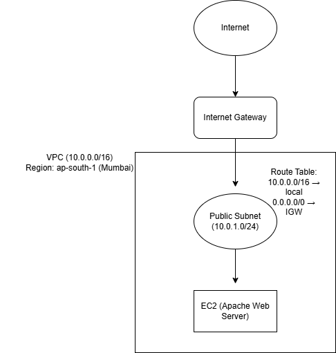

# AWS 2-Tier Architecture (Public Web Server)

##Project Overview
This project demonstrates deployment of a secure public web server using AWS.

##Architecture Components

- VPC (10.0.0.0/16)
- Public Subnet (10.0.1.0/24)
- Internet Gateway
- Route Table
- EC2 (Amazon Linux 2023, t3.micro)
- Security Group (SSH restricted, HTTP open)

##Region
ap-south-1 (Mumbai)

##Architecture Diagram



##Deployment Steps

1. Created custom VPC (10.0.0.0/16)
2. Created Public Subnet
3. Attached Internet Gateway
4. Configured Route Table (0.0.0.0/0 → IGW)
5. Launched EC2 instance

##EC2 Configuration Commands

```bash
sudo dnf update -y
sudo dnf install httpd -y
sudo systemctl start httpd
sudo systemctl enable httpd

6. Installed Apache
7. Configured Security Group

##Result

Apache Web Server successfully deployed and accessible via Public IP.
